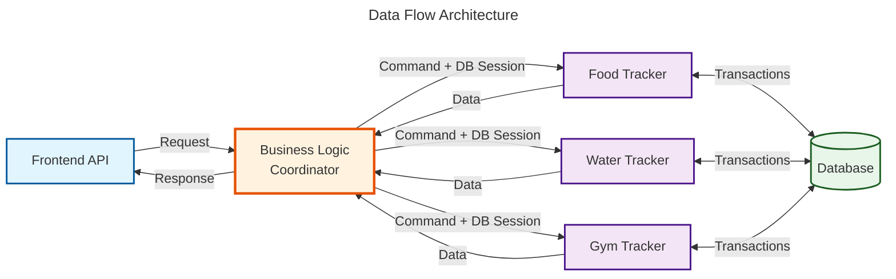

```mermaid
---
title: Data Flow Architecture
---
graph LR
    Frontend[Frontend API] -->|Request| Coordinator[Business Logic<br/>Coordinator]
    Coordinator -->|Response| Frontend
    
    Coordinator -->|Command + DB Session| Food[Food Tracker]
    Coordinator -->|Command + DB Session| Water[Water Tracker]
    Coordinator -->|Command + DB Session| Gym[Gym Tracker]
    
    Food -->|Data| Coordinator
    Water -->|Data| Coordinator
    Gym -->|Data| Coordinator
    
    Food <-->|Transactions| DB[(Database)]
    Water <-->|Transactions| DB
    Gym <-->|Transactions| DB
    
    classDef frontend fill:#e1f5ff,stroke:#01579b,stroke-width:2px
    classDef business fill:#fff3e0,stroke:#e65100,stroke-width:3px
    classDef module fill:#f3e5f5,stroke:#4a148c,stroke-width:2px
    classDef data fill:#e8f5e9,stroke:#1b5e20,stroke-width:2px
    
    class Frontend frontend
    class Coordinator business
    class Food,Water,Gym module
    class DB data
```